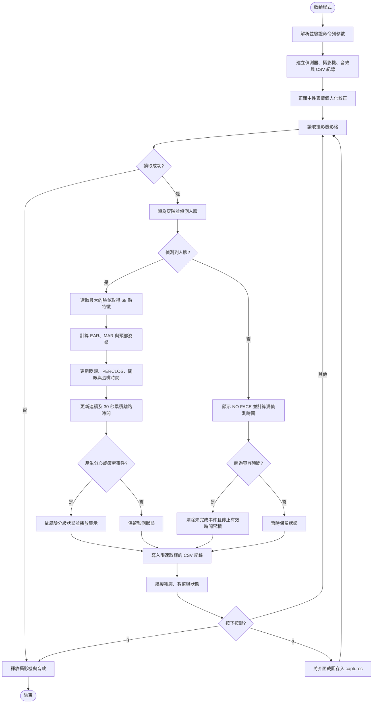

# Driver Drowsiness Detection

[](https://github.com/s960137/driver-drowsiness-detection/actions/workflows/tests.yml)

以攝影機即時偵測駕駛狀態，結合眼睛長寬比（EAR）、嘴巴長寬比（MAR）、時間加權 PERCLOS、頭部姿態與眨眼率，示範疲勞、微睡眠、睡眠、無反應及離路注意力警示。

> [!WARNING]
> 本專案僅研究與教學，尚未經過真實車輛或安全場景驗證，不能取代駕駛注意力，也不應作為防止事故的依據。

## 功能

- 使用 Dlib 68 點臉部特徵模型定位眼睛與嘴巴。
- 啟動時以 10 秒正面中性表情，校正個人 EAR／MAR 與頭部正面角度。
- 以 60 秒滑動視窗計算「有效觀測時間」內的閉眼比例（PERCLOS）。
- 以頭部 pitch／yaw 作為離路注意力代理，偵測連續與 30 秒累積分心。
- 以完整的「閉眼 → 睜眼」週期計算一次眨眼，避免每幀重複累計。
- 以單調時鐘計算連續閉眼及張嘴時間，不依賴攝影機回報的 FPS。
- 將閉眼事件分成 `MICROSLEEP`、`SLEEP` 與 `UNRESPONSIVE`。
- 每 0.2 秒將量測值與狀態寫入本機 CSV，供後續驗證誤報率與警示延遲。
- 警示音具冷卻時間，避免每一幀重複播放。
- 短暫漏偵測人臉時保留狀態，超過容許時間才重設未完成事件。
- 無人臉時顯示 `NO FACE`，並選取畫面中最大的臉進行分析。

## 執行介面

OpenCV 視窗會在臉部影像上描繪雙眼與嘴巴輪廓，左上角顯示：

| 顯示項目 | 說明 |
| --- | --- |
| `Blinks` | 程式啟動後的完整眨眼總數 |
| `EAR` | 目前雙眼 EAR 平均值；越低代表眼睛越閉合 |
| `MAR` | 目前嘴巴 MAR；越高代表嘴巴張得越開 |
| `PERCLOS` | 滑動視窗內閉眼時間占有效觀測時間的比例 |
| `Head P/Y` | 相對於個人正面基準的 pitch／yaw 角度；目前是頭部方向，不是精確眼球視線 |
| `Last BPM` | 最近一個完整時間視窗的每分鐘眨眼次數 |
| 狀態列 | `CALIBRATING`、`MONITORING`、`DISTRACTED`、`DROWSY`、`MICROSLEEP`、`SLEEP`、`UNRESPONSIVE` 或 `NO FACE` 等狀態 |

按 `s` 會將包含輪廓、數值與狀態的當前畫面存到 `captures/`；按 `q` 可安全關閉視窗、釋放攝影機並停止音效。截圖可能包含個人影像，因此 `captures/` 已排除於 Git 版本控制之外。

啟動後請正對鏡頭、自然睜眼並閉嘴，保持頭部靜止直到 `CALIBRATION COMPLETE`。若顯示 `CALIBRATION: NO FACE`，請改善光線、減少晃動並確認臉部完整入鏡。

## 程式流程圖

下圖直接對應 `src/drowsiness_monitor.py` 的執行流程，可在 GitHub README 中原生顯示。



## 專案結構

```text
.
├── .github/workflows/     # GitHub Actions 單元測試
├── archive/original/      # 2024 年原始 eyes_mouths.py
├── assets/                # 原型使用的警示音
├── src/
│   ├── drowsiness_monitor.py  # 攝影機、介面與整體流程
│   ├── drowsiness_state.py    # 眨眼、睡眠、哈欠狀態機
│   ├── head_pose.py           # 頭部 pitch／yaw／roll 估計
│   ├── landmark_metrics.py    # EAR 與 MAR 幾何計算
│   ├── temporal_metrics.py    # PERCLOS、校正與累積分心
│   └── session_log.py         # 限速取樣的 CSV 工作階段紀錄
└── tests/                  # 不需要攝影機即可執行的單元測試
```

原始 `eyes_mouths.py` 保留在 `archive/original/`，實際執行請使用 `src/` 內的整理版。整理版修正了原始程式重複計算眨眼／哈欠、依賴不可靠攝影機 FPS，以及警示音每幀重播等問題。

## 安裝

建議使用 Python 3.11。

```bash
python -m venv .venv
```

啟用虛擬環境後安裝套件：

```bash
python -m pip install -r requirements.txt
```

下載並解壓縮 Dlib 官方 68 點特徵模型：

<http://dlib.net/files/shape_predictor_68_face_landmarks.dat.bz2>

模型約 95 MiB，因此未納入版本控制。Dlib 說明此模型以 iBUG 300-W 資料集訓練，而該資料集授權不允許商業使用；用於研究或教學以外的情境前，請先確認上游授權。

## 執行

```bash
python src/drowsiness_monitor.py --shape-predictor shape_predictor_68_face_landmarks.dat
```

無音效模式：

```bash
python src/drowsiness_monitor.py --shape-predictor shape_predictor_68_face_landmarks.dat --no-audio
```

主要可調參數：

| 參數 | 預設值 | 用途 |
| --- | ---: | --- |
| `--camera-index` | `0` | 攝影機編號 |
| `--screenshot-dir` | `captures/` | 按 `s` 時儲存介面截圖的位置 |
| `--log-dir` | `logs/` | CSV 工作階段紀錄位置；`--no-log` 可停用 |
| `--calibration-seconds` | `10.0` | 個人化中性表情校正時間；設為 `0` 可停用 |
| `--ear-threshold` | `0.23` | 低於此值視為閉眼 |
| `--minimum-blink-frames` | `3` | 成立一次眨眼所需的最少閉眼影格 |
| `--fatigue-seconds` | `1.0` | 微睡眠閉眼警示時間 |
| `--sleep-seconds` | `3.0` | 睡眠閉眼警示時間 |
| `--unresponsive-seconds` | `6.0` | 無反應閉眼警示時間 |
| `--mar-threshold` | `0.75` | 高於此值視為張嘴 |
| `--yawn-seconds` | `0.8` | 連續張嘴警示時間 |
| `--perclos-window` | `60.0` | PERCLOS 滑動時間視窗 |
| `--perclos-min-observation` | `20.0` | 顯示 PERCLOS 前所需的有效觀測秒數 |
| `--perclos-threshold` | `0.40` | 示範用 PERCLOS 警示比例 |
| `--head-yaw-threshold` | `25.0` | 相對正面 yaw 離路門檻（度） |
| `--head-pitch-threshold` | `20.0` | 相對正面 pitch 離路門檻（度） |
| `--long-distraction-seconds` | `3.0` | 連續離路警示時間 |
| `--cumulative-distraction-seconds` | `10.0` | 30 秒內累積離路警示時間 |
| `--blink-rate-threshold` | `30.0` | 每分鐘眨眼率警示門檻 |
| `--face-loss-grace-seconds` | `0.25` | 短暫漏偵測時保留狀態的秒數；設為 `0` 可停用 |
| `--alert-cooldown` | `3.0` | 兩次警示音之間的最短秒數 |

EAR、MAR 與正面頭部角度預設會在啟動時個人化；其他門檻仍是研究示範值，未經真實道路資料驗證。若停用校正，程式會使用命令列 EAR／MAR 固定門檻，並停用需要正面基準的頭部離路警示。

CSV 包含時間、EAR、MAR、門檻、PERCLOS、頭部角度、累積離路秒數與系統狀態，不包含影像。`logs/` 與 `captures/` 都已排除於 Git 版本控制。

## 測試

```bash
python -m unittest discover -s tests -v
```

每次推送到 `main` 或建立 Pull Request 時，GitHub Actions 也會自動執行不需要攝影機與 Dlib 的單元測試。

## 已完成與後續改善方向

目前已加入個人化校正、時間加權 PERCLOS、粗略頭部姿態、連續／累積分心、分級閉眼狀態、CSV 研究紀錄、漏偵測容錯與自動測試。後續建議依序進行：

1. 以支援虹膜的模型加入真正的眼球視線區域；目前頭部姿態只能作為離路注意力代理。
2. 蒐集不同使用者、眼鏡、光線與鏡頭角度的標註資料，評估 precision、recall、每小時誤報及警示延遲。
3. 加入 GPS／OBD-II 車速、方向盤與車道偏移訊號，避免把靜止或非駕駛情境當成風險。
4. 改用近紅外線攝影機與授權清楚的臉部／虹膜模型，改善夜間、墨鏡及逆光表現。
5. 依真實資料調整 PERCLOS 與頭部門檻，而不是把目前示範值視為安全認證值。

## 設計依據

- NHTSA 的車輛式疲勞偵測研究回顧指出，PERCLOS 是所比較指標中較一致的嗜睡分類依據，但仍受個體、光線與眼鏡影響：[NHTSA report](https://www.nhtsa.gov/sites/nhtsa.gov/files/811886-assess_veh-based_sensors_4_drowsy-driving_detection.pdf)。
- Euro NCAP 2026 Driver Engagement protocol 將 1–2 秒閉眼作為微睡眠、持續閉眼至少 3 秒作為睡眠測試情境，並評估連續與累積離路注意力：[Driver Engagement Protocol v1.2](https://cdn.euroncap.com/cars/assets/Euro_NCAP_Protocol_Safe_Driving_Driver_Engagement_v1_2_ebce03a443.pdf)。
- 本專案採研究原型定位，不代表符合 Euro NCAP 或歐盟 DDAW 型式認證；正式系統還需要日夜、遮擋、不同族群與真實道路驗證。

## 發布、隱私與授權

- 勿提交 `.venv`、本機編譯的 Dlib、平台專用 wheel 或臉部特徵模型。
- 程式只在本機處理攝影機影格，不會主動傳送或保存影像。
- CSV 行為紀錄與截圖都只保留在本機忽略目錄；公開前應取得被攝者同意並移除敏感資料。
- EAR 方法參考 Soukupová 與 Čech（2016）；原始原型改寫自 Adrian Rosebrock 的 PyImageSearch 眨眼偵測教學，詳見 [THIRD_PARTY_NOTICES.md](THIRD_PARTY_NOTICES.md)。
- 本專案尚未選定整體開源授權；在加入授權檔前，專案程式與媒體仍受作者預設著作權保護，第三方元件則各自依其授權條款使用。
