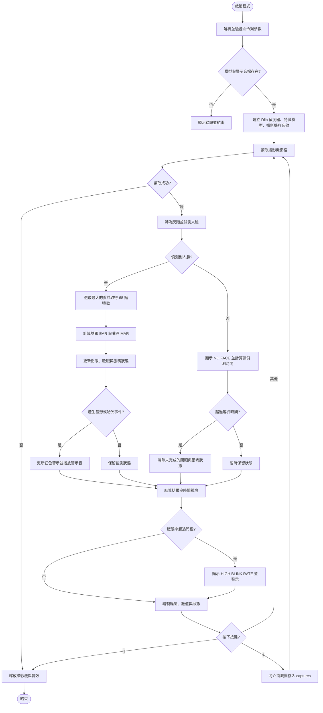

# Driver Drowsiness Detection

[](https://github.com/s960137/driver-drowsiness-detection/actions/workflows/tests.yml)

以攝影機即時偵測駕駛臉部特徵，結合眼睛長寬比（Eye Aspect Ratio, EAR）、嘴巴長寬比（Mouth Aspect Ratio, MAR）與每分鐘眨眼次數，示範閉眼疲勞、頻繁眨眼及打哈欠警示。

> [!WARNING]
> 本專案僅研究與教學，尚未經過真實車輛或安全場景驗證，不能取代駕駛注意力，也不應作為防止事故的依據。

## 功能

- 使用 Dlib 68 點臉部特徵模型定位眼睛與嘴巴。
- 以完整的「閉眼 → 睜眼」週期計算一次眨眼，避免每幀重複累計。
- 以單調時鐘計算連續閉眼及張嘴時間，不依賴攝影機回報的 FPS。
- 偵測長時間閉眼、打哈欠及一分鐘視窗內的高眨眼率。
- 警示音具冷卻時間，避免每一幀重複播放。
- 短暫漏偵測人臉時保留狀態，超過容許時間才重設未完成事件。
- 無人臉時顯示 `NO FACE`，並選取畫面中最大的臉進行分析。

## 執行介面

OpenCV 視窗會在臉部影像上描繪雙眼與嘴巴輪廓，左上角顯示：

| 顯示項目 | 說明 |
| --- | --- |
| `Blinks` | 程式啟動後的完整眨眼總數 |
| `EAR` | 目前雙眼 EAR 平均值；越低代表眼睛越閉合 |
| `MAR` | 目前嘴巴 MAR；越高代表嘴巴張得越開 |
| `Last BPM` | 最近一個完整時間視窗的每分鐘眨眼次數 |
| 狀態列 | `MONITORING`、`NO FACE`、`LONG EYE CLOSURE`、`YAWN DETECTED` 或 `HIGH BLINK RATE` |

按 `s` 會將包含輪廓、數值與狀態的當前畫面存到 `captures/`；按 `q` 可安全關閉視窗、釋放攝影機並停止音效。截圖可能包含個人影像，因此 `captures/` 已排除於 Git 版本控制之外。

## 程式流程圖

下圖直接對應 `src/drowsiness_monitor.py` 的執行流程，可在 GitHub README 中原生顯示。



## 專案結構

```text
.
├── .github/workflows/     # GitHub Actions 單元測試
├── archive/original/      # 2024 年原始 eyes_mouths.py
├── assets/                # 原型使用的警示音
├── src/
│   ├── drowsiness_monitor.py  # 攝影機、介面與整體流程
│   ├── drowsiness_state.py    # 眨眼、疲勞、哈欠狀態機
│   └── landmark_metrics.py    # EAR 與 MAR 幾何計算
└── tests/                  # 不需要攝影機即可執行的單元測試
```

原始 `eyes_mouths.py` 保留在 `archive/original/`，實際執行請使用 `src/` 內的整理版。整理版修正了原始程式重複計算眨眼／哈欠、依賴不可靠攝影機 FPS，以及警示音每幀重播等問題。

## 安裝

建議使用 Python 3.11。

```bash
python -m venv .venv
```

啟用虛擬環境後安裝套件：

```bash
python -m pip install -r requirements.txt
```

下載並解壓縮 Dlib 官方 68 點特徵模型：

<http://dlib.net/files/shape_predictor_68_face_landmarks.dat.bz2>

模型約 95 MiB，因此未納入版本控制。Dlib 說明此模型以 iBUG 300-W 資料集訓練，而該資料集授權不允許商業使用；用於研究或教學以外的情境前，請先確認上游授權。

## 執行

```bash
python src/drowsiness_monitor.py --shape-predictor shape_predictor_68_face_landmarks.dat
```

無音效模式：

```bash
python src/drowsiness_monitor.py --shape-predictor shape_predictor_68_face_landmarks.dat --no-audio
```

主要可調參數：

| 參數 | 預設值 | 用途 |
| --- | ---: | --- |
| `--camera-index` | `0` | 攝影機編號 |
| `--screenshot-dir` | `captures/` | 按 `s` 時儲存介面截圖的位置 |
| `--ear-threshold` | `0.23` | 低於此值視為閉眼 |
| `--minimum-blink-frames` | `3` | 成立一次眨眼所需的最少閉眼影格 |
| `--fatigue-seconds` | `1.0` | 連續閉眼警示時間 |
| `--mar-threshold` | `0.75` | 高於此值視為張嘴 |
| `--yawn-seconds` | `0.8` | 連續張嘴警示時間 |
| `--blink-rate-threshold` | `30.0` | 每分鐘眨眼率警示門檻 |
| `--face-loss-grace-seconds` | `0.25` | 短暫漏偵測時保留狀態的秒數；設為 `0` 可停用 |
| `--alert-cooldown` | `3.0` | 兩次警示音之間的最短秒數 |

這些預設值沿用研究原型，未針對特定使用者、鏡頭、光線或車內環境校正。

## 測試

```bash
python -m unittest discover -s tests -v
```

每次推送到 `main` 或建立 Pull Request 時，GitHub Actions 也會自動執行不需要攝影機與 Dlib 的單元測試。

## 已完成與後續可改善方向

本次整理已加入輸入資料與命令列參數驗證、短暫人臉漏偵測容錯、`NO FACE` 介面狀態、更多單元測試及 GitHub Actions。後續建議依序進行：

1. 蒐集不同使用者、眼鏡、光線與鏡頭角度的資料，建立個人化 EAR／MAR 校正流程。
2. 加入頭部姿態、視線偏移及 PERCLOS 等特徵，降低固定門檻造成的誤報。
3. 以標註影片評估 precision、recall、F1 與警示延遲，而不只測試程式邏輯。
4. 改用可重新散布且授權清楚的臉部特徵模型，並評估 MediaPipe 等較易安裝的替代方案。
5. 在取得警示音的所有權或再散布授權後，再公開 `assets/alert.wav`。

## 發布、隱私與授權

- 請勿提交 `.venv`、本機編譯的 Dlib、平台專用 wheel 或臉部特徵模型。
- 程式只在本機處理攝影機影格，不會主動傳送或保存影像。
- EAR 方法參考 Soukupová 與 Čech（2016）；原始原型改寫自 Adrian Rosebrock 的 PyImageSearch 眨眼偵測教學，詳見 [THIRD_PARTY_NOTICES.md](THIRD_PARTY_NOTICES.md)。
- 本專案尚未選定整體開源授權；在加入授權檔前，專案程式與媒體仍受作者預設著作權保護，第三方元件則各自依其授權條款使用。
